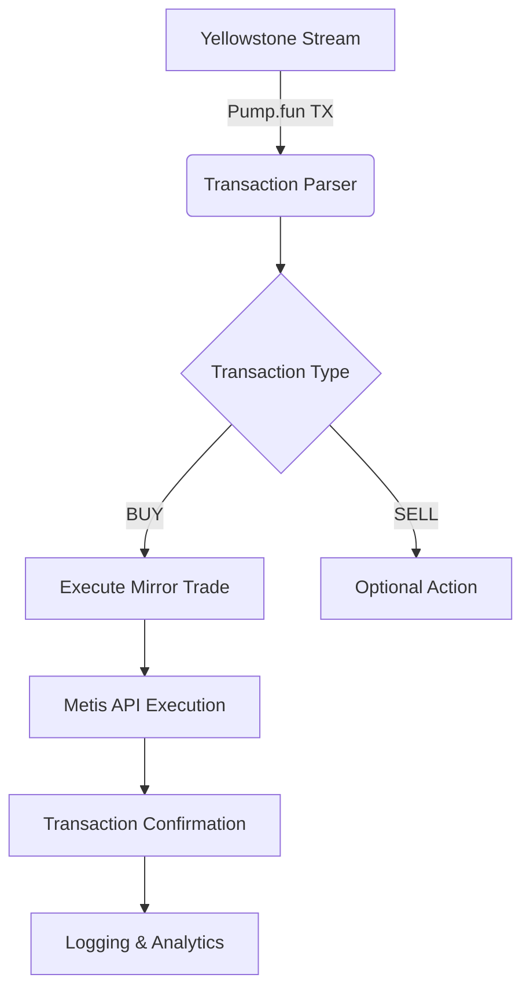

# Creating a Solana Copy Trading Bot Using Pump.fun API and Yellowstone gRPC

This comprehensive guide demonstrates how to build a Solana-based trading bot that replicates transactions from specified wallets on the Pump.fun decentralized exchange. The implementation leverages the QuickNode Metis plugin and Yellowstone gRPC streaming capabilities for real-time blockchain monitoring.

## Key Features and Components

1. **Pump.fun Integration**  
   Utilizes the Jupiter V6 Swap API through Metis for executing trades
2. **Real-time Monitoring**  
   Implements Yellowstone gRPC for streaming blockchain events
3. **Automated Trading Logic**  
   Customizable thresholds for transaction replication
4. **Robust Error Handling**  
   Comprehensive transaction validation and fallback mechanisms

## Core Technologies

| Technology        | Purpose                          | Version/Implementation          |
|-------------------|----------------------------------|----------------------------------|
| Solana Web3.js    | Blockchain interaction           | v1.x                            |
| Yellowstone gRPC  | Real-time event streaming        | QuickNode plugin                |
| Metis API         | Transaction execution            | Jupiter V6 Swap integration     |
| Node.js           | Runtime environment              | 18.x+                           |

## Getting Started

### System Requirements

- Node.js 18.x or higher
- npm package manager
- Solana wallet with test SOL
- QuickNode account with:
  - Metis plugin enabled
  - Yellowstone gRPC access
  - Mainnet RPC endpoint

### Security Note

This guide is for educational purposes only. Trading bots carry financial risks. Always test with small amounts and implement proper risk management.

👉 [Start with secure blockchain development tools](https://bit.ly/okx-bonus)

## Implementation Architecture



## Configuration Setup

### Environment Variables (.env)

```env
SOLANA_RPC=https://your-quicknode-endpoint.solana-mainnet.quiknode.pro/
SECRET_KEY=[0,123,45,...,255]
METIS_ENDPOINT=https://your-metis-endpoint.quiknode.pro/
YELLOWSTONE_ENDPOINT=https://your-yellowstone-endpoint.solana-mainnet.quiknode.pro:10000
YELLOWSTONE_TOKEN=your-quicknode-api-token
```

### Core Configuration Parameters

```javascript
config = {
  WATCH_LIST: ["TARGET_WALLET_1", "TARGET_WALLET_2"],
  PUMP_FUN: {
    PROGRAM_ID: "6EF8rrecthR5Dkzon8Nwu78hRvfCKubJ14M5uBEwF6P",
    FEE_ACCOUNT: "CebN5WGQ4jvEPvsVU4EoHEpgzq1VV7AbicfhtW4xC9iM",
    BUY_DISCRIMINATOR: Buffer.from([102, 6, 61, 18, 1, 218, 235, 234]),
    SELL_DISCRIMINATOR: Buffer.from([51, 230, 133, 164, 1, 127, 131, 173])
  },
  MIN_TX_AMOUNT: LAMPORTS_PER_SOL / 1000,
  BUY_AMOUNT: LAMPORTS_PER_SOL / 100,
  TEST_MODE: true
};
```

## Core Functionality Implementation

### Transaction Monitoring

```javascript
async function handleData(data) {
  if (!isValidTransaction(data)) return;
  
  const instructions = parseInstructions(data);
  const trade = analyzeTrade(instructions);
  
  if (trade.type === 'BUY' && trade.amount >= config.MIN_TX_AMOUNT) {
    await executeMirrorTrade(trade);
  }
}
```

### Transaction Execution Pipeline

1. **Transaction Detection**  
   Monitor target wallets using Yellowstone filters
2. **Instruction Parsing**  
   Identify Pump.fun program interactions
3. **Discriminator Matching**  
   Determine transaction type (BUY/SELL)
4. **Mirror Trade Execution**  
   Generate, sign, and submit equivalent transaction

### Error Handling Framework

```javascript
async function sendAndConfirmTransaction(signedTx) {
  try {
    const txid = await connection.sendEncodedTransaction(
      signedTx, 
      { skipPreflight: false }
    );
    
    await waitForConfirmation(txid);
    return txid;
    
  } catch (error) {
    logError({
      timestamp: new Date(),
      error: error.message,
      transaction: signedTx
    });
    return null;
  }
}
```

👉 [Access professional blockchain tools](https://bit.ly/okx-bonus)

## Advanced Implementation Patterns

### Dynamic Position Sizing Strategy

```javascript
function calculatePositionSize(whaleAmount, portfolioValue) {
  const whaleBalance = getBalance(whalePublicKey);
  const riskFactor = calculateRiskFactor();
  
  return Math.min(
    config.MAX_POSITION,
    whaleAmount * riskFactor * (portfolioValue / whaleBalance)
  );
}
```

### Multi-Layered Filtering System

| Filter Type       | Description                      | Implementation                  |
|-------------------|----------------------------------|----------------------------------|
| Account Filter    | Target specific wallets          | WATCH_LIST array                |
| Program Filter    | Focus on Pump.fun interactions   | Program ID validation           |
| Amount Filter     | Minimum transaction threshold    | MIN_TX_AMOUNT parameter         |
| Time Filter       | Trading hours restrictions       | Schedule-based validation       |

## Testing and Validation

### Test Mode Verification

1. Enable test mode:
```javascript
config.TEST_MODE = true;
```

2. Execute sample transaction:
```javascript
node bot.js
# Should output simulated transaction without network interaction
```

### Production Readiness Checklist

- [ ] Wallet balance verification
- [ ] RPC endpoint health checks
- [ ] Transaction simulation validation
- [ ] Error recovery mechanisms
- [ ] Comprehensive logging implementation

## Deployment Best Practices

1. **Security Measures**
   - Store secrets in secure vaults
   - Implement rate limiting
   - Use hardware wallets for production

2. **Monitoring Requirements**
   - Real-time alert system
   - Transaction success metrics
   - Network latency monitoring

3. **Scaling Considerations**
   - Horizontal scaling for multiple wallets
   - Priority fee optimization
   - Load balancing across RPC endpoints

## Frequently Asked Questions

### What is the minimum required SOL balance?

The bot requires at least 0.1 SOL for operational costs, with additional funds needed for trading positions. For production use, we recommend maintaining a balance of 1-5 SOL depending on trading frequency.

### How does the bot handle network congestion?

The system implements dynamic priority fee adjustment with configurable levels (low/medium/high/auto). In high congestion scenarios, the bot can automatically increase transaction fees to maintain execution reliability.

### Can I customize the replication strategy?

Yes! The architecture supports multiple customization points:
- Position sizing algorithms
- Transaction filtering criteria
- Timing strategies (immediate vs delayed execution)
- Risk management parameters

### What happens during node failures?

The implementation includes automatic reconnection logic for Yellowstone streams. Failed transactions are automatically retried with exponential backoff, and all state is persisted to disk for recovery.

### How are transaction fees managed?

The bot implements intelligent fee calculation based on:
- Current network congestion
- Transaction complexity
- Priority fee settings
- Historical fee data analysis

## Performance Optimization Techniques

### Transaction Batching Strategy

```javascript
async function batchProcessor() {
  const batch = collectTransactions(5000ms);
  if (batch.length > 1) {
    const combinedTx = mergeTransactions(batch);
    await executeBatch(combinedTx);
  }
}
```

### Network Optimization Parameters

| Parameter              | Default Value | Optimized Value |
|------------------------|---------------|-----------------|
| Timeout                | 30s           | 15s             |
| Retry Attempts         | 3             | 5               |
| Polling Interval       | 3s            | 1s              |
| Max Concurrent Streams | 1             | 5               |

## Regulatory Compliance

When implementing automated trading systems, consider the following compliance requirements:

1. **Know Your Customer (KYC)**  
   Ensure all participating wallets are properly verified

2. **Anti-Money Laundering (AML)**  
   Implement transaction pattern analysis for suspicious activity

3. **Tax Reporting**  
   Maintain detailed transaction records for accounting purposes

4. **Exchange Compliance**  
   Review terms of service for all interacting platforms

👉 [Explore compliant blockchain solutions](https://bit.ly/okx-bonus)

## Future Enhancements

### Planned Features

1. **Machine Learning Integration**
   - Predictive analytics for whale behavior
   - Adaptive strategy optimization
   - Market sentiment analysis

2. **Cross-Chain Support**
   - Multi-chain transaction replication
   - Interoperability with other EVM chains
   - Cross-chain arbitrage opportunities

3. **Advanced Risk Management**
   - Dynamic stop-loss implementation
   - Portfolio diversification strategies
   - Real-time risk exposure dashboard

4. **User Interface Development**
   - Web-based configuration panel
   - Real-time transaction visualization
   - Strategy performance analytics

## Community and Support

For troubleshooting and implementation support:

- Join the Solana developer Discord
- Visit QuickNode's developer portal
- Follow blockchain development forums
- Attend Solana-focused hackathons

This implementation provides a robust foundation for building sophisticated trading systems on Solana. By combining real-time blockchain monitoring with programmable execution capabilities, developers can create innovative DeFi applications that respond to market dynamics with minimal latency.

Remember to always test thoroughly in development environments before deploying to production networks. The modular architecture allows for easy customization and extension to meet specific trading strategy requirements.